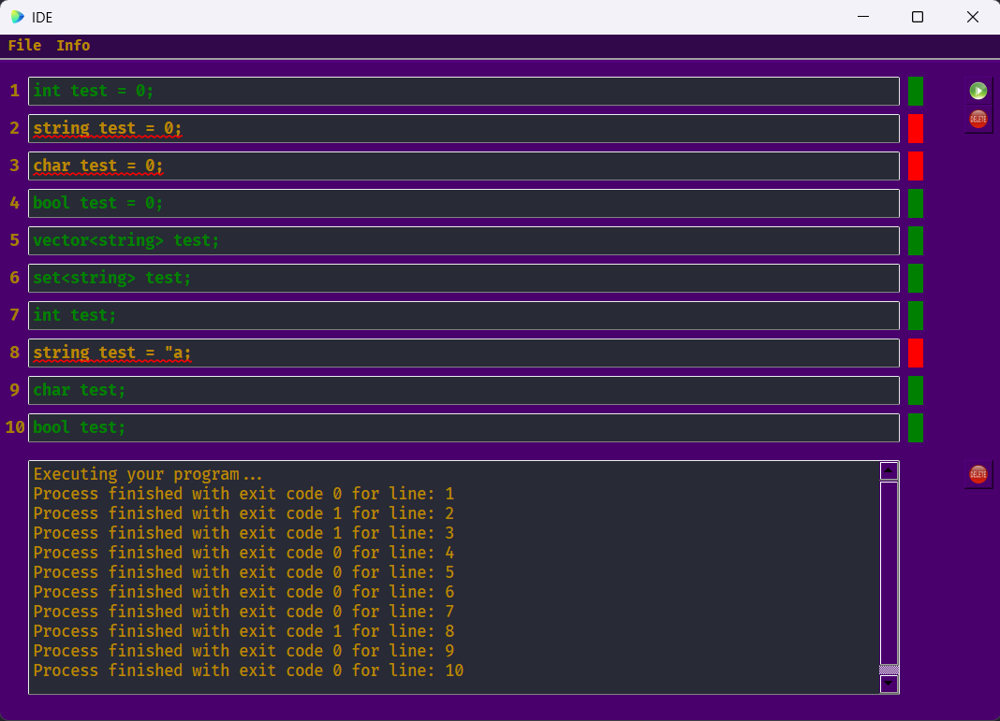

# IDE

This project is a simple IDE that incorporates an SLR parser to handle declarations and initializations in C++.
This project is built using QT framework and it works in C++11. 
# Groepsleden:

- Riwaaz Ranabhat
- Abobaker Rahman
- Aaditya Nepal
- Raadin Bahrami
 
 

